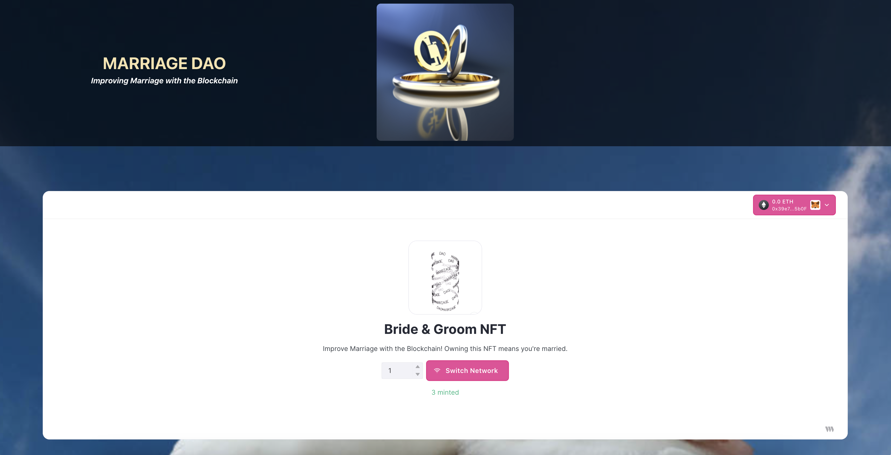

# Miami Hack Week 2023 🌴
## PROJECT NAME: Marriage DAO
### SUBMITTED BY: DAO House

This repository contains the React website code for Marriage DAO. It is a website that allows users to connect their preferred web3 wallet to create a marriage contract to be stored on the "Polygon MainNet" Etherium blockchain network.

 
 
 

# iOS/Android App for Marriage DAO is in a different [Repository](https://github.com/Zernach/marriage-dao-mobile)
